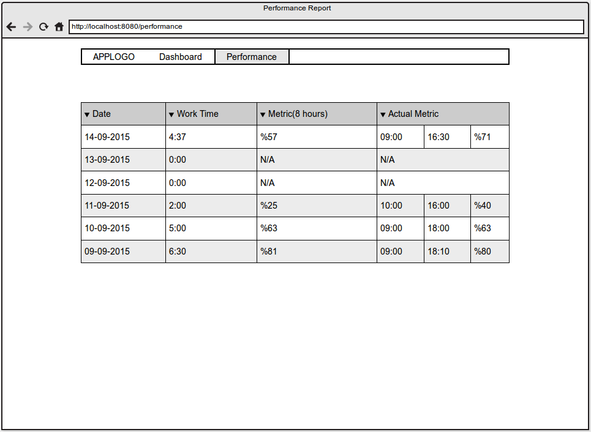
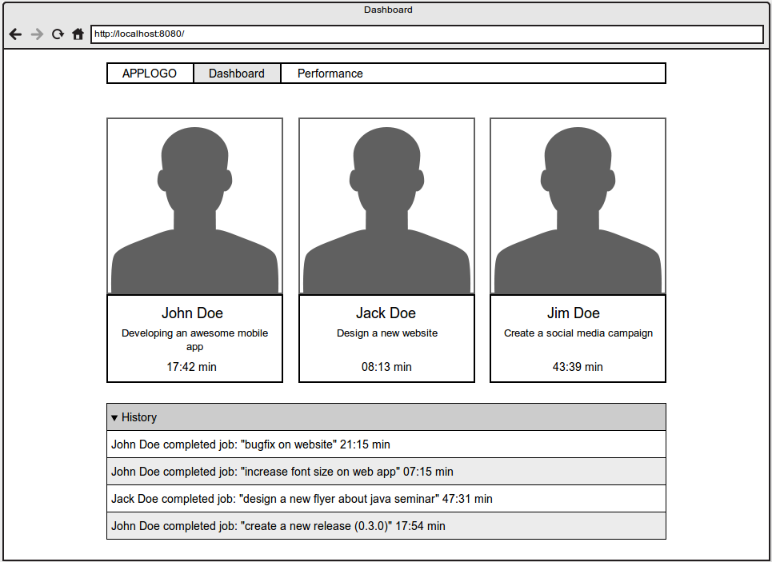

Kod Gemisi Sample Application
=============================

This application is provided as a base for your assigned work. It has a pre-configured database, security and MVC structure to help get you started quickly.

http://semantic-ui.com/ is used as UI library.

Installation
------------

1) **Create a database for the application**

The application uses `postgresql` database by default. You can use another database if you wish however you need to configure the application accordingly in that case.

Following commands are provided as a hint to create a database and a database user for the application:

```bash
# for debian based linux  OS

# Create a db user
~/<current_directory>$  sudo -u postgres createuser -D -A -P demouser
could not change directory to "/home/<username>/<current_directory>": Permission denied
Enter password for new role:
Enter it again:

# Create a db of which our db user is the owner
~/<current_directory>$ sudo -u postgres createdb -O demouser demodb
could not change directory to "/home/<username>/<current_directory>": Permission denied
~/<current_directory>$
```

2) Import the project as a maven project into your IDE

3) Copy `application-sample.properties` as `application-dev.properties` and edit its content accordingly. (the file is in the path  `src/resources/application-sample.properties`)

Otherwise you will encounter following error:

```
org.springframework.beans.factory.BeanDefinitionStoreException: Failed to parse configuration class [RootConfig]; nested exception is java.io.FileNotFoundException: class path resource [application-dev.properties] cannot be opened because it does not exist
```

4) Run the application, it will create the database tables automatically for you thanks to Hibernate.

The path of application when deployed in eclipse: `http://localhost:8080/sample/`

**Default Credentials**

username: `user@kodgemisi.com`

password: `123qwe123`

Todos
-----

1) **Create a Toggl Time Report App**

We're using [toggl](https://toggl.com/) as time tracking app. Toggl gives us some reports about how much time we and our team spend on projects but we need some additional reports. We need to see our performance based on some metrics(1.1) and we need to see the current status of our colleagues(1.2).

1.1) **Performance Tool**

* User should register/login to the app. (You don't need to implement this part. App currently have login and register functionality.) What you need to do is make registration publicly available so that _anyone can register as a new user_.

* User should create a toggl api token and save it to the app (you may save token in settings/profile page or you may redirect user to save token page if user has not. You're free on the implementation)

* App should get all time entries of user since last two months and store them in database.

* App should give a list to the user with the date and performance metric and actual performance metric.

    * You need to calculate performance metric with proportion of time spent in a day to the total time in a day(8 hours by default). For example,  if a user logged 5 hours in a day, the performance index is 0.625
    * You need to calculate actual performance metric with proportion of time spent in a day to the total available time in a day. For example, user starts working at 9.30 and stops working at 16.30. Total available time is 6 hours. If user has logged 5 hours, the actual performance index is 0.83. Please note that user has a 1 hour lunch time, you need to decrease total time by 1 hour.
    * You're free to add additional features to the list. You may use a graph to show data, add a pagination to list, add filter, etc. You may want to cache performance metric and actual performance metric to make performance improvements.

You can see a mock of the performance report below:



1.2) **Team Status Tool**

* User should invite his teammates
* Teammate should register himself/herself to the app
* Teammate should create a toggl api token and save it to the app
* People should see the actual processes of teammates(You need to make a toggl api query with your teammates api token to learn the actual status of your teammate)

You can see a mock of the team report below:



2) When you open `User > User list with items` page from header, there is an error occurs. Why this error occurs? Please solve it assuming application's performance is critical.

3) (bonus) What would be your future enhancements on this app?

Intellectual Property Rights
----------------------------

You, hereby carrying out this assignment and eventually submitting your derived work to Kod Gemisi Ltd., approve to license all your commits to this code base with GNU Affero General Public License version 3 (AGPL v3).

Short version: All your commits must be under AGPL v3, otherwise we cannot accept them.

License
-------

This application's source code is licensed under AGPL v3.

AGPL v3 <http://www.gnu.org/licenses/agpl-3.0.en.html>

Copyright (C) 2015 Kod Gemisi Ltd.
